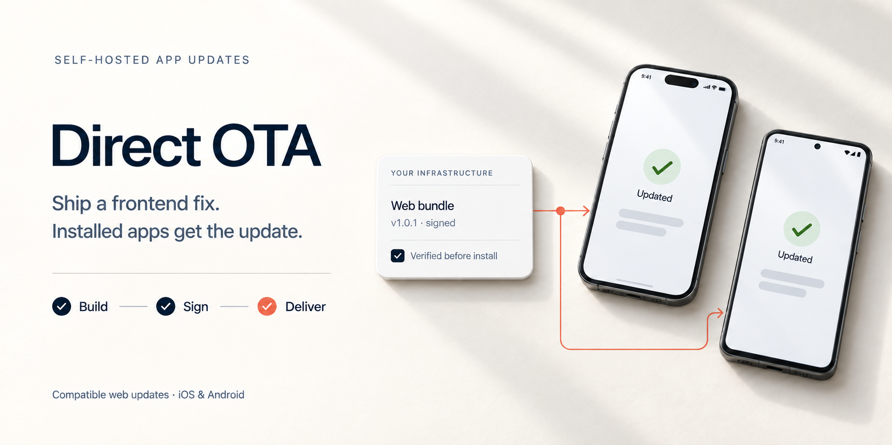

# Direct OTA

**Ship frontend fixes to installed mobile apps without a new App Store or Google Play submission for every compatible change.**

Direct OTA publishes signed JavaScript, HTML, CSS, and asset updates for Capacitor apps on iOS and Android. Fix a broken screen, adjust a layout, or update frontend behavior, then let installed apps download the compatible release from infrastructure you control.

Build and publish from your computer or CI. Once the files are uploaded, your computer can go offline. There is no Direct OTA account, subscription, or hosted control panel to run.

The native updater is built on [Capgo's open-source Capacitor updater](https://github.com/Cap-go/capacitor-updater). This project adds a publishing CLI, signed release protocol, native safety controls, and backend implementations. It is an independent project, not an official Capgo product.

## What can I update?

| Change | Delivery |
| --- | --- |
| Compatible web UI, styles, images, and JavaScript fixes | OTA after the updater is in the installed native app |
| Native plugins, Swift/Kotlin code, permissions, or native configuration | New native build and store release |
| Backend logic | Your existing backend deployment |

OTA does not bypass store rules. Check [Apple's review guidelines](https://developer.apple.com/app-store/review/guidelines/) and [Google Play's device and network policy](https://support.google.com/googleplay/android-developer/answer/9888379) for the changes you plan to ship. A compatible technical change is not automatically an allowed policy change.

## Keep your backend

Your app does **not** need to use Supabase.

- **Supabase provider:** use Storage and Edge Functions for updates, even if your app uses Firebase, Django, Laravel, a custom API, or another backend.
- **Cloudflare provider:** use a Worker, D1, and R2 for an isolated update service, regardless of your app backend.
- **Firebase provider:** use a dedicated Firebase project with Hosting, Functions, Firestore, and private Storage, regardless of your app backend.
- **Node provider:** run the update service next to your existing backend, using SQLite and a persistent artifact directory behind HTTPS.
- **Custom provider:** implement the [HTTP contract](docs/protocol.md) in your own stack. The app's database and authentication remain separate from update delivery.

Supabase and Cloudflare have free tiers with usage limits. Direct OTA has no subscription fee; hosting and downloads still consume resources. A 3 MB bundle delivered to 100,000 devices is about 300 GB before retries. Cloudflare's Workers Free limit is currently [100,000 requests per day](https://developers.cloudflare.com/workers/platform/pricing/), so a large fleet needs a measured capacity plan.

## Supported apps

The included native integration targets **Capacitor 8 on iOS and Android**, with the updater pinned to **8.51.25**. React, Vue, Angular, Svelte, and plain web apps can use it when packaged with Capacitor.

Pure Swift/Kotlin apps, React Native, Expo, Flutter, desktop apps, and arbitrary WebViews do not work with this integration unchanged. The publishing protocol can be reused, but each runtime needs its own secure downloader, verifier, activation mechanism, and rollback integration. See [compatibility and adaptation](docs/compatibility.md).

## Get started

Requires Node 24+, Python 3, and an existing Capacitor 8 project. For native builds, use the usual Xcode and Android toolchains.

Install the tarball attached to [the latest release](https://github.com/ibsz909i/direct-ota/releases). For a Capacitor 8 app using Supabase to deliver updates, preview and run the guided local setup:

```sh
npm install --save-exact ./direct-ota-0.6.0.tgz @capgo/capacitor-updater@8.51.25 @capacitor/app@8
npx direct-ota setup --provider supabase --base-url https://YOUR_PROJECT.supabase.co --plan
npx direct-ota setup --provider supabase --base-url https://YOUR_PROJECT.supabase.co
```

The interactive command shows its local changes before applying them. It detects the app ID, web directory, and native platforms, creates a **new private publishing identity**, exports a configured Supabase provider, and prepares native settings. It does **not** deploy a migration, Edge Function, bucket, or update. Review the exported files and follow the [setup guide](docs/quickstart.md) for deployment and native integration. For automation, `--yes` applies only the described local changes.

For Cloudflare, replace the two `setup` commands above with `--provider cloudflare --base-url https://YOUR_WORKER.YOUR_SUBDOMAIN.workers.dev`, then follow the [Cloudflare guide](docs/providers/cloudflare.md). For the Node provider or an existing integration, use the separate `init`, `export-provider`, and `native` commands in the provider guides. Setup never uses your application account or backend service key as the publishing identity.
Firebase has a matching `setup --provider firebase` flow; it requires a dedicated Blaze project before live deployment. See the [Firebase guide](docs/providers/firebase.md). A prepared **dedicated Cloudflare or Firebase** service can use `setup --finish --provider ... --plan` to preview the exact deployment and native sync. Repeat with `--apply --dedicated` to merge a simple JSON/TypeScript Capacitor config, sync and verify the native settings, deploy only to the selected provider resources, run read-only conformance, and check each platform's metadata endpoint. It does not enable billing, create resources, publish a release, or build and test the app on a device. Shared Supabase projects retain their reviewed migration procedure.

For a custom backend, `create-provider --name my-backend --out ./ota-provider` exports the typed provider admission layer and a fail-closed adapter scaffold. Run `test-provider` against your service; `test-provider --write` exercises publication and withdrawal using an isolated synthetic runtime. See [provider conformance](docs/provider-conformance.md).
Keep both native plugins as direct app dependencies so Capacitor 8 discovers them. If your Capacitor config uses `includePlugins`, include both on every target platform; `native` and `doctor` check actual plugin discovery. `doctor` now gives a readiness report; `doctor --fix` repairs only generated settings and a JSON host config for the same signing identity. It never changes a recorded native runtime or private keys. Sync and rebuild after a repair before claiming a device is ready.

Continue with the [setup guide](docs/quickstart.md). It covers deploying a provider, integrating the native updater, protecting in-progress actions, and sending your first update. After the initial native release, the everyday flow is:

```sh
npx direct-ota publish --platform ios --version 1.0.1
npx direct-ota doctor --remote --platform ios
```

`publish` runs the host app's `npm run build`, checks the native runtime, prepares and uploads an immutable bundle, promotes it to **internal**, then confirms the channel head. Run it once per platform. `doctor --remote` verifies the signed live instruction, public artifact bytes, and range downloads. Test the internal update on a device before advancing production. Each platform has its own channel head; production rollouts remain explicit operator actions. See [publishing and recovery](docs/publishing.md).

## Release safety

- Signed manifests bind releases to an app, environment, platform, channel, native runtime, and backend contract.
- Devices reject modified bundles, unknown keys, incompatible runtimes, and unapproved download locations.
- Publish commands expire quickly and cannot be replayed. Channel changes use compare-and-swap to prevent conflicting publishes.
- Downloads retain partial files, validate range responses, pause without cellular consent, and retry recoverable failures.
- Protected actions can finish before activation. Your app registers those actions with the activity guard.
- Startup health is reported locally. Failed startup restores a working bundle and quarantines the failed artifact.

These controls reduce risk; they cannot guarantee every update succeeds. An offline phone still needs a connection, and a bug that appears after startup still needs a tested rollback or fix. Read [security](SECURITY.md), [operations](docs/operations.md), and [verification](docs/verification.md) before a production rollout.

## Using an AI coding agent

Give your agent this repository and ask:

> Assess my app for Direct OTA, explain the supported integration path, and set it up using my existing backend or a separate update-only provider. Follow AGENTS.md and skills/direct-ota/SKILL.md. Keep private keys out of source control.

The [agent guide](AGENTS.md) includes compatibility checks, integration boundaries, and a focused release workflow. It tells the agent to test changed behavior and update-related risks, without demanding an unrelated full-app test pass for every small UI fix.

## Documentation

- [Setup](docs/quickstart.md) · [Native integration](docs/native-integration.md)
- [Supabase](docs/providers/supabase.md) · [Cloudflare](docs/providers/cloudflare.md) · [Firebase](docs/providers/firebase.md) · [Node service](docs/providers/node.md)
- [Provider conformance](docs/provider-conformance.md)
- [Protocol](docs/protocol.md) · [Compatibility](docs/compatibility.md)
- [Publishing](docs/publishing.md) · [Operations](docs/operations.md)
- [Case study: a loyalty app](docs/case-study.md) · [Verification](docs/verification.md)
- [Contributing](CONTRIBUTING.md) · [Security](SECURITY.md)

## License

[MPL-2.0](LICENSE). See [NOTICE](NOTICE) for upstream attribution. You can integrate the library into an application without publishing unrelated application code; changes to MPL-covered files have their own source obligations. See the [Mozilla FAQ](https://www.mozilla.org/en-US/MPL/2.0/FAQ/).
